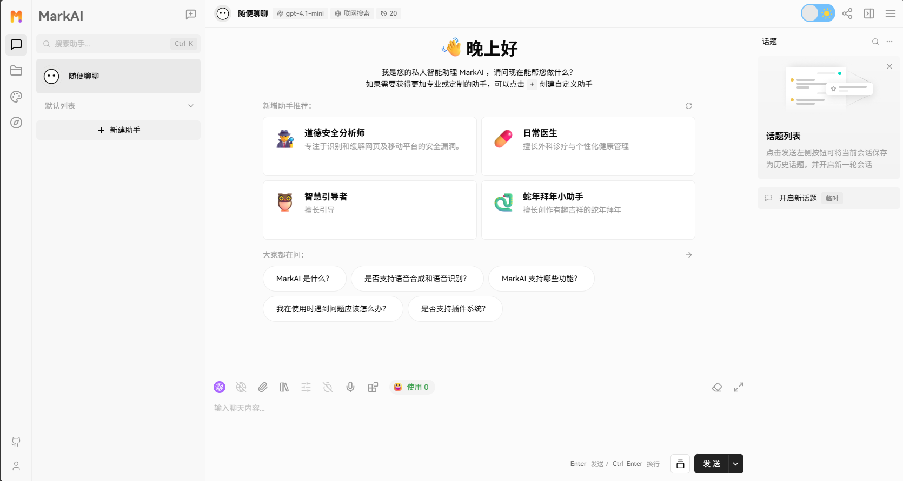
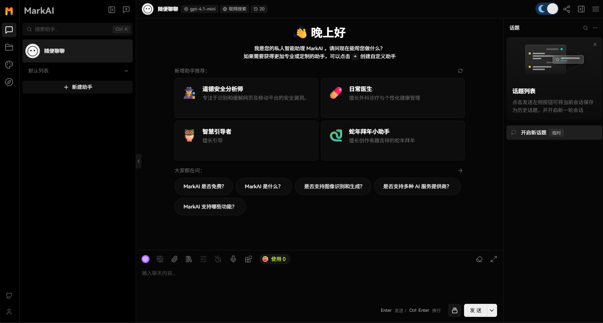
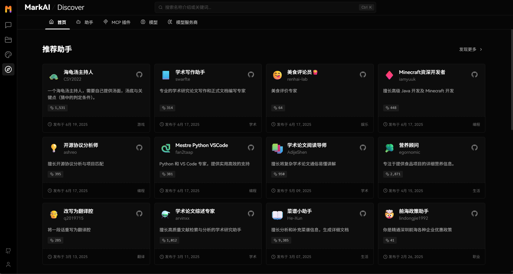

# MarkAI

An open-source, modern design ChatGPT/LLMs UI/framework. 
Supports speech synthesis, multi-modal, and extensible (\[function call]\[docs-function-call]) plugin system. 
One-click **FREE** deployment of your private OpenAI ChatGPT/Claude/Gemini/Groq/Ollama chat application.

**English** · [简体中文](./README.zh-CN.md)

<!-- SHIELD GROUP -->

[![][github-release-shield]][github-release-link]
[![][docker-release-shield]][docker-release-link]
[![][vercel-shield]][vercel-link]
[![][discord-shield]][discord-link] 
[![][codecov-shield]][codecov-link]
[![][github-action-test-shield]][github-action-test-link]
[![][github-action-release-shield]][github-action-release-link]
[![][github-releasedate-shield]][github-releasedate-link] 
[![][github-license-shield]][github-license-link] 
[![][sponsor-shield]][sponsor-link]

Pioneering the new age of thinking and creating. Built for you, the Super Individual.

<kbd>Table of contents</kbd>

#### TOC

- [👋🏻 Getting Started & Join Our Community](#-getting-started--join-our-community)
- [✨ Features](#-features)
  - [✨ MCP Plugin One-Click Installation](#-mcp-plugin-one-click-installation)
  - [🏪 MCP Marketplace](#-mcp-marketplace)
  - [🖥️ Desktop App](#️-desktop-app)
  - [🌐 Smart Internet Search](#-smart-internet-search)
  - [Chain of Thought](#chain-of-thought)
  - [Branching Conversations](#branching-conversations)
  - [Artifacts Support](#artifacts-support)
  - [File Upload /Knowledge Base](#file-upload-knowledge-base)
  - [Multi-Model Service Provider Support](#multi-model-service-provider-support)
  - [Local Large Language Model (LLM) Support](#local-large-language-model-llm-support)
  - [Model Visual Recognition](#model-visual-recognition)
  - [TTS & STT Voice Conversation](#tts--stt-voice-conversation)
  - [Text to Image Generation](#text-to-image-generation)
  - [Plugin System (Function Calling)](#plugin-system-function-calling)
  - [Agent Market (GPTs)](#agent-market-gpts)
  - [Support Local / Remote Database](#support-local--remote-database)
  - [Progressive Web App (PWA)](#progressive-web-app-pwa)
  - [Mobile Device Adaptation](#mobile-device-adaptation)
  - [Custom Themes](#custom-themes)
  - [`*` What's more](#-whats-more)

####

 

## 👋🏻 Getting Started & Join Our Community

We are a group of e/acc design-engineers, hoping to provide modern design components and tools for AIGC.
By adopting the Bootstrapping approach, we aim to provide developers and users with a more open, transparent, and user-friendly product ecosystem.

Whether for users or professional developers, MarkAI will be your AI Agent playground. Please be aware that MarkAI is currently under active development, and feedback is welcome for any issues encountered.

| [![][vercel-shield-badge]][vercel-link]   | No installation or registration necessary! Visit our website to experience it firsthand.                           |
| :---------------------------------------- | :----------------------------------------------------------------------------------------------------------------- |
| [![][discord-shield-badge]][discord-link] | Join our Discord community! This is where you can connect with developers and other enthusiastic users of LobeHub. |

> \[!IMPORTANT]
>
> **Star Us**, You will receive all release notifications from GitHub without any delay \~ ⭐️

## ✨ Features

Transform your AI experience with MarkAI's powerful features designed for seamless connectivity, enhanced productivity, and unlimited creativity.

### ✨ MCP Plugin One-Click Installation

**Seamlessly Connect Your AI to the World**

Unlock the full potential of your AI by enabling smooth, secure, and dynamic interactions with external tools, data sources, and services. MarkAI's MCP (Model Context Protocol) plugin system breaks down the barriers between your AI and the digital ecosystem, allowing for unprecedented connectivity and functionality.

Transform your conversations into powerful workflows by connecting to databases, APIs, file systems, and more. Experience the freedom of AI that truly understands and interacts with your world.

[![][back-to-top]](#readme-top)

### 🏪 MCP Marketplace

**Discover, Connect, Extend**

Browse a growing library of MCP plugins to expand your AI's capabilities and streamline your workflows effortlessly. Visit [lobehub.com/mcp](https://lobehub.com/mcp) to explore the MCP Marketplace, which offers a curated collection of integrations that enhance your AI's ability to work with various tools and services.

From productivity tools to development environments, discover new ways to extend your AI's reach and effectiveness. Connect with the community and find the perfect plugins for your specific needs.

[![][back-to-top]](#readme-top)

### 🖥️ Desktop App

**Peak Performance, Zero Distractions**

Get the full MarkAI experience without browser limitations—lightweight, focused, and always ready to go. Our desktop application provides a dedicated environment for your AI interactions, ensuring optimal performance and minimal distractions.

Experience faster response times, better resource management, and a more stable connection to your AI assistant. The desktop app is designed for users who demand the best performance from their AI tools.

[![][back-to-top]](#readme-top)

### 🌐 Smart Internet Search

**Online Knowledge On Demand**

With real-time internet access, your AI keeps up with the world—news, data, trends, and more. Stay informed and get the most current information available, enabling your AI to provide accurate and up-to-date responses.

Access live information, verify facts, and explore current events without leaving your conversation. Your AI becomes a gateway to the world's knowledge, always current and comprehensive.

[![][back-to-top]](#readme-top)

### [Chain of Thought][docs-feat-cot]

Experience AI reasoning like never before. Watch as complex problems unfold step by step through our innovative Chain of Thought (CoT) visualization. This breakthrough feature provides unprecedented transparency into AI's decision-making process, allowing you to observe how conclusions are reached in real-time.

By breaking down complex reasoning into clear, logical steps, you can better understand and validate the AI's problem-solving approach. Whether you're debugging, learning, or simply curious about AI reasoning, CoT visualization transforms abstract thinking into an engaging, interactive experience.

[![][back-to-top]](#readme-top)

### [Branching Conversations][docs-feat-branch]

Introducing a more natural and flexible way to chat with AI. With Branch Conversations, your discussions can flow in multiple directions, just like human conversations do. Create new conversation branches from any message, giving you the freedom to explore different paths while preserving the original context.

Choose between two powerful modes:

- **Continuation Mode:** Seamlessly extend your current discussion while maintaining valuable context
- **Standalone Mode:** Start fresh with a new topic based on any previous message

This groundbreaking feature transforms linear conversations into dynamic, tree-like structures, enabling deeper exploration of ideas and more productive interactions.

[![][back-to-top]](#readme-top)

### [Artifacts Support][docs-feat-artifacts]

Experience the power of Claude Artifacts, now integrated into LobeChat. This revolutionary feature expands the boundaries of AI-human interaction, enabling real-time creation and visualization of diverse content formats.

Create and visualize with unprecedented flexibility:

- Generate and display dynamic SVG graphics
- Build and render interactive HTML pages in real-time
- Produce professional documents in multiple formats

[![][back-to-top]](#readme-top)

### [File Upload /Knowledge Base][docs-feat-knowledgebase]

MarkAI supports file upload and knowledge base functionality. You can upload various types of files including documents, images, audio, and video, as well as create knowledge bases, making it convenient for users to manage and search for files. Additionally, you can utilize files and knowledge base features during conversations, enabling a richer dialogue experience.

[![][back-to-top]](#readme-top)

### [Multi-Model Service Provider Support][docs-feat-provider]

In the continuous development of MarkAI, we deeply understand the importance of diversity in model service providers for meeting the needs of the community when providing AI conversation services. Therefore, we have expanded our support to multiple model service providers, rather than being limited to a single one, in order to offer users a more diverse and rich selection of conversations.

In this way, MarkAI can more flexibly adapt to the needs of different users, while also providing developers with a wider range of choices.

#### Supported Model Service Providers

We have implemented support for the following model service providers:

<!-- PROVIDER LIST -->

- **[OpenAI](https://lobechat.com/discover/provider/openai)**: OpenAI is a global leader in artificial intelligence research, with models like the GPT series pushing the frontiers of natural language processing. OpenAI is committed to transforming multiple industries through innovative and efficient AI solutions. Their products demonstrate significant performance and cost-effectiveness, widely used in research, business, and innovative applications.
- **[Ollama](https://lobechat.com/discover/provider/ollama)**: Ollama provides models that cover a wide range of fields, including code generation, mathematical operations, multilingual processing, and conversational interaction, catering to diverse enterprise-level and localized deployment needs.
- **[Anthropic](https://lobechat.com/discover/provider/anthropic)**: Anthropic is a company focused on AI research and development, offering a range of advanced language models such as Claude 3.5 Sonnet, Claude 3 Sonnet, Claude 3 Opus, and Claude 3 Haiku. These models achieve an ideal balance between intelligence, speed, and cost, suitable for various applications from enterprise workloads to rapid-response scenarios. Claude 3.5 Sonnet, as their latest model, has excelled in multiple evaluations while maintaining a high cost-performance ratio.
- **[Bedrock](https://lobechat.com/discover/provider/bedrock)**: Bedrock is a service provided by Amazon AWS, focusing on delivering advanced AI language and visual models for enterprises. Its model family includes Anthropic's Claude series, Meta's Llama 3.1 series, and more, offering a range of options from lightweight to high-performance, supporting tasks such as text generation, conversation, and image processing for businesses of varying scales and needs.
- **[Google](https://lobechat.com/discover/provider/google)**: Google's Gemini series represents its most advanced, versatile AI models, developed by Google DeepMind, designed for multimodal capabilities, supporting seamless understanding and processing of text, code, images, audio, and video. Suitable for various environments from data centers to mobile devices, it significantly enhances the efficiency and applicability of AI models.
- **[DeepSeek](https://lobechat.com/discover/provider/deepseek)**: DeepSeek is a company focused on AI technology research and application, with its latest model DeepSeek-V2.5 integrating general dialogue and code processing capabilities, achieving significant improvements in human preference alignment, writing tasks, and instruction following.
- **[HuggingFace](https://lobechat.com/discover/provider/huggingface)**: The HuggingFace Inference API provides a fast and free way for you to explore thousands of models for various tasks. Whether you are prototyping for a new application or experimenting with the capabilities of machine learning, this API gives you instant access to high-performance models across multiple domains.
- **[OpenRouter](https://lobechat.com/discover/provider/openrouter)**: OpenRouter is a service platform providing access to various cutting-edge large model interfaces, supporting OpenAI, Anthropic, LLaMA, and more, suitable for diverse development and application needs. Users can flexibly choose the optimal model and pricing based on their requirements, enhancing the AI experience.
- **[Cloudflare Workers AI](https://lobechat.com/discover/provider/cloudflare)**: Run serverless GPU-powered machine learning models on Cloudflare's global network.
- **[GitHub](https://lobechat.com/discover/provider/github)**: With GitHub Models, developers can become AI engineers and leverage the industry's leading AI models.

<kbd>See more providers (+31)</kbd>

- **[Novita](https://lobechat.com/discover/provider/novita)**: Novita AI is a platform providing a variety of large language models and AI image generation API services, flexible, reliable, and cost-effective. It supports the latest open-source models like Llama3 and Mistral, offering a comprehensive, user-friendly, and auto-scaling API solution for generative AI application development, suitable for the rapid growth of AI startups.
- **[PPIO](https://lobechat.com/discover/provider/ppio)**: PPIO supports stable and cost-efficient open-source LLM APIs, such as DeepSeek, Llama, Qwen etc.
- **[Together AI](https://lobechat.com/discover/provider/togetherai)**: Together AI is dedicated to achieving leading performance through innovative AI models, offering extensive customization capabilities, including rapid scaling support and intuitive deployment processes to meet various enterprise needs.
- **[Fireworks AI](https://lobechat.com/discover/provider/fireworksai)**: Fireworks AI is a leading provider of advanced language model services, focusing on functional calling and multimodal processing. Its latest model, Firefunction V2, is based on Llama-3, optimized for function calling, conversation, and instruction following. The visual language model FireLLaVA-13B supports mixed input of images and text. Other notable models include the Llama series and Mixtral series, providing efficient multilingual instruction following and generation support.
- **[Groq](https://lobechat.com/discover/provider/groq)**: Groq's LPU inference engine has excelled in the latest independent large language model (LLM) benchmarks, redefining the standards for AI solutions with its remarkable speed and efficiency. Groq represents instant inference speed, demonstrating strong performance in cloud-based deployments.
- **[Perplexity](https://lobechat.com/discover/provider/perplexity)**: Perplexity is a leading provider of conversational generation models, offering various advanced Llama 3.1 models that support both online and offline applications, particularly suited for complex natural language processing tasks.
- **[Mistral](https://lobechat.com/discover/provider/mistral)**: Mistral provides advanced general, specialized, and research models widely used in complex reasoning, multilingual tasks, and code generation. Through functional calling interfaces, users can integrate custom functionalities for specific applications.
- **[ModelScope](https://lobechat.com/discover/provider/modelscope)**: ModelScope is a model-as-a-service platform launched by Alibaba Cloud, offering a wide range of AI models and inference services.
- **[Ai21Labs](https://lobechat.com/discover/provider/ai21)**: AI21 Labs builds foundational models and AI systems for enterprises, accelerating the application of generative AI in production.
- **[Upstage](https://lobechat.com/discover/provider/upstage)**: Upstage focuses on developing AI models for various business needs, including Solar LLM and document AI, aiming to achieve artificial general intelligence (AGI) for work. It allows for the creation of simple conversational agents through Chat API and supports functional calling, translation, embedding, and domain-specific applications.
- **[xAI (Grok)](https://lobechat.com/discover/provider/xai)**: xAI is a company dedicated to building artificial intelligence to accelerate human scientific discovery. Our mission is to advance our collective understanding of the universe.
- **[Aliyun Bailian](https://lobechat.com/discover/provider/qwen)**: Tongyi Qianwen is a large-scale language model independently developed by Alibaba Cloud, featuring strong natural language understanding and generation capabilities. It can answer various questions, create written content, express opinions, and write code, playing a role in multiple fields.
- **[Wenxin](https://lobechat.com/discover/provider/wenxin)**: An enterprise-level one-stop platform for large model and AI-native application development and services, providing the most comprehensive and user-friendly toolchain for the entire process of generative artificial intelligence model development and application development.
- **[Hunyuan](https://lobechat.com/discover/provider/hunyuan)**: A large language model developed by Tencent, equipped with powerful Chinese creative capabilities, logical reasoning abilities in complex contexts, and reliable task execution skills.
- **[ZhiPu](https://lobechat.com/discover/provider/zhipu)**: Zhipu AI offers an open platform for multimodal and language models, supporting a wide range of AI application scenarios, including text processing, image understanding, and programming assistance.
- **[SiliconCloud](https://lobechat.com/discover/provider/siliconcloud)**: SiliconFlow is dedicated to accelerating AGI for the benefit of humanity, enhancing large-scale AI efficiency through an easy-to-use and cost-effective GenAI stack.
- **[01.AI](https://lobechat.com/discover/provider/zeroone)**: 01.AI focuses on AI 2.0 era technologies, vigorously promoting the innovation and application of 'human + artificial intelligence', using powerful models and advanced AI technologies to enhance human productivity and achieve technological empowerment.
- **[Spark](https://lobechat.com/discover/provider/spark)**: iFlytek's Spark model provides powerful AI capabilities across multiple domains and languages, utilizing advanced natural language processing technology to build innovative applications suitable for smart hardware, smart healthcare, smart finance, and other vertical scenarios.
- **[SenseNova](https://lobechat.com/discover/provider/sensenova)**: SenseNova, backed by SenseTime's robust infrastructure, offers efficient and user-friendly full-stack large model services.
- **[Stepfun](https://lobechat.com/discover/provider/stepfun)**: StepFun's large model possesses industry-leading multimodal and complex reasoning capabilities, supporting ultra-long text understanding and powerful autonomous scheduling search engine functions.
- **[Moonshot](https://lobechat.com/discover/provider/moonshot)**: Moonshot is an open-source platform launched by Beijing Dark Side Technology Co., Ltd., providing various natural language processing models with a wide range of applications, including but not limited to content creation, academic research, intelligent recommendations, and medical diagnosis, supporting long text processing and complex generation tasks.
- **[Baichuan](https://lobechat.com/discover/provider/baichuan)**: Baichuan Intelligence is a company focused on the research and development of large AI models, with its models excelling in domestic knowledge encyclopedias, long text processing, and generative creation tasks in Chinese, surpassing mainstream foreign models. Baichuan Intelligence also possesses industry-leading multimodal capabilities, performing excellently in multiple authoritative evaluations. Its models include Baichuan 4, Baichuan 3 Turbo, and Baichuan 3 Turbo 128k, each optimized for different application scenarios, providing cost-effective solutions.
- **[Minimax](https://lobechat.com/discover/provider/minimax)**: MiniMax is a general artificial intelligence technology company established in 2021, dedicated to co-creating intelligence with users. MiniMax has independently developed general large models of different modalities, including trillion-parameter MoE text models, voice models, and image models, and has launched applications such as Conch AI.
- **[InternLM](https://lobechat.com/discover/provider/internlm)**: An open-source organization dedicated to the research and development of large model toolchains. It provides an efficient and user-friendly open-source platform for all AI developers, making cutting-edge large models and algorithm technologies easily accessible.
- **[Higress](https://lobechat.com/discover/provider/higress)**: Higress is a cloud-native API gateway that was developed internally at Alibaba to address the issues of Tengine reload affecting long-lived connections and the insufficient load balancing capabilities for gRPC/Dubbo.
- **[Gitee AI](https://lobechat.com/discover/provider/giteeai)**: Gitee AI's Serverless API provides AI developers with an out of the box large model inference API service.
- **[Taichu](https://lobechat.com/discover/provider/taichu)**: The Institute of Automation, Chinese Academy of Sciences, and Wuhan Artificial Intelligence Research Institute have launched a new generation of multimodal large models, supporting comprehensive question-answering tasks such as multi-turn Q\&A, text creation, image generation, 3D understanding, and signal analysis, with stronger cognitive, understanding, and creative abilities, providing a new interactive experience.
- **[360 AI](https://lobechat.com/discover/provider/ai360)**: 360 AI is an AI model and service platform launched by 360 Company, offering various advanced natural language processing models, including 360GPT2 Pro, 360GPT Pro, 360GPT Turbo, and 360GPT Turbo Responsibility 8K. These models combine large-scale parameters and multimodal capabilities, widely applied in text generation, semantic understanding, dialogue systems, and code generation. With flexible pricing strategies, 360 AI meets diverse user needs, supports developer integration, and promotes the innovation and development of intelligent applications.
- **[Search1API](https://lobechat.com/discover/provider/search1api)**: Search1API provides access to the DeepSeek series of models that can connect to the internet as needed, including standard and fast versions, supporting a variety of model sizes.
- **[InfiniAI](https://lobechat.com/discover/provider/infiniai)**: Provides high-performance, easy-to-use, and secure large model services for application developers, covering the entire process from large model development to service deployment.
- **[Qiniu](https://lobechat.com/discover/provider/qiniu)**: Qiniu, as a long-established cloud service provider, delivers cost-effective and reliable AI inference services for both real-time and batch processing, with a simple and user-friendly experience.

> 📊 Total providers: [<kbd>**41**</kbd>](https://lobechat.com/discover/providers)

 <!-- PROVIDER LIST -->

At the same time, we are also planning to support more model service providers. If you would like MarkAI to support your favorite service provider, feel free to join our community discussion.

[![][back-to-top]](#readme-top)

### [Local Large Language Model (LLM) Support][docs-feat-local]

To meet the specific needs of users, MarkAI also supports the use of local models based on [Ollama](https://ollama.ai), allowing users to flexibly use their own or third-party models.

[![][back-to-top]](#readme-top)

### [Model Visual Recognition][docs-feat-vision]

MarkAI now supports OpenAI's latest [`gpt-4-vision`](https://platform.openai.com/docs/guides/vision) model with visual recognition capabilities,
a multimodal intelligence that can perceive visuals. Users can easily upload or drag and drop images into the dialogue box,
and the agent will be able to recognize the content of the images and engage in intelligent conversation based on this,
creating smarter and more diversified chat scenarios.

This feature opens up new interactive methods, allowing communication to transcend text and include a wealth of visual elements.
Whether it's sharing images in daily use or interpreting images within specific industries, the agent provides an outstanding conversational experience.

[![][back-to-top]](#readme-top)

### [TTS & STT Voice Conversation][docs-feat-tts]

MarkAI supports Text-to-Speech (TTS) and Speech-to-Text (STT) technologies, enabling our application to convert text messages into clear voice outputs,
allowing users to interact with our conversational agent as if they were talking to a real person. Users can choose from a variety of voices to pair with the agent.

Moreover, TTS offers an excellent solution for those who prefer auditory learning or desire to receive information while busy.
In MarkAI, we have meticulously selected a range of high-quality voice options (OpenAI Audio, Microsoft Edge Speech) to meet the needs of users from different regions and cultural backgrounds.
Users can choose the voice that suits their personal preferences or specific scenarios, resulting in a personalized communication experience.

[![][back-to-top]](#readme-top)

### [Text to Image Generation][docs-feat-t2i]

With support for the latest text-to-image generation technology, MarkAI now allows users to invoke image creation tools directly within conversations with the agent. By leveraging the capabilities of AI tools such as [`DALL-E 3`](https://openai.com/dall-e-3), [`MidJourney`](https://www.midjourney.com/), and [`Pollinations`](https://pollinations.ai/), the agents are now equipped to transform your ideas into images.

This enables a more private and immersive creative process, allowing for the seamless integration of visual storytelling into your personal dialogue with the agent.

[![][back-to-top]](#readme-top)

### [Plugin System (Function Calling)][docs-feat-plugin]

The plugin ecosystem of MarkAI is an important extension of its core functionality, greatly enhancing the practicality and flexibility of the MarkAI assistant.

<video controls src="https://github.com/lobehub/lobe-chat/assets/28616219/f29475a3-f346-4196-a435-41a6373ab9e2" muted="false"></video>

By utilizing plugins, MarkAI assistants can obtain and process real-time information, such as searching for web information and providing users with instant and relevant news.

In addition, these plugins are not limited to news aggregation, but can also extend to other practical functions, such as quickly searching documents, generating images, obtaining data from various platforms like Bilibili, Steam, and interacting with various third-party services.

<!-- PLUGIN LIST -->

| Recent Submits                                                                                                               | Description                                                                                                             |
| ---------------------------------------------------------------------------------------------------------------------------- | ----------------------------------------------------------------------------------------------------------------------- |
| [PortfolioMeta](https://lobechat.com/discover/plugin/StockData) By **portfoliometa** on **2025-07-21**        | Analyze stocks and get comprehensive real-time investment data and analytics. `stock`                               |
| [Speak](https://lobechat.com/discover/plugin/speak) By **speak** on **2025-07-18**                            | Learn how to say anything in another language with Speak, your AI-powered language tutor. `education` `language`    |
| [Web](https://lobechat.com/discover/plugin/web) By **Proghit** on **2025-01-24**                              | Smart web search that reads and analyzes pages to deliver comprehensive answers from Google results. `web` `search` |
| [Bing_websearch](https://lobechat.com/discover/plugin/Bingsearch-identifier) By **FineHow** on **2024-12-22** | Search for information from the internet base BingApi `bingsearch`                                                  |

> 📊 Total plugins: [<kbd>**43**</kbd>](https://lobechat.com/discover/plugins)

 <!-- PLUGIN LIST -->

[![][back-to-top]](#readme-top)

### [Agent Market (GPTs)][docs-feat-agent]

In MarkAI Agent Marketplace, creators can discover a vibrant and innovative community that brings together a multitude of well-designed agents,
which not only play an important role in work scenarios but also offer great convenience in learning processes.
Our marketplace is not just a showcase platform but also a collaborative space. Here, everyone can contribute their wisdom and share the agents they have developed.

> \[!TIP]
>
> By [🤖/🏪 Submit Agents][submit-agents-link], you can easily submit your agent creations to our platform.
> Importantly, MarkAI has established a sophisticated automated internationalization (i18n) workflow,
> capable of seamlessly translating your agent into multiple language versions.
> This means that no matter what language your users speak, they can experience your agent without barriers.

> \[!IMPORTANT]
>
> We welcome all users to join this growing ecosystem and participate in the iteration and optimization of agents.
> Together, we can create more interesting, practical, and innovative agents, further enriching the diversity and practicality of the agent offerings.

<!-- AGENT LIST -->

| Recent Submits                                                                                                                                                                 | Description                                                                                                                                                                                                              |
| ------------------------------------------------------------------------------------------------------------------------------------------------------------------------------ | ------------------------------------------------------------------------------------------------------------------------------------------------------------------------------------------------------------------------ |
| [Turtle Soup Host](https://lobechat.com/discover/assistant/lateral-thinking-puzzle) By **[CSY2022](https://github.com/CSY2022)** on **2025-06-19**              | A turtle soup host needs to provide the scenario, the complete story (truth of the event), and the key point (the condition for guessing correctly). `turtle-soup` `reasoning` `interaction` `puzzle` `role-playing` |
| [Gourmet Reviewer🍟](https://lobechat.com/discover/assistant/food-reviewer) By **[renhai-lab](https://github.com/renhai-lab)** on **2025-06-17**                | Food critique expert `gourmet` `review` `writing`                                                                                                                                                                    |
| [Academic Writing Assistant](https://lobechat.com/discover/assistant/academic-writing-assistant) By **[swarfte](https://github.com/swarfte)** on **2025-06-17** | Expert in academic research paper writing and formal documentation `academic-writing` `research` `formal-style`                                                                                                      |
| [Minecraft Senior Developer](https://lobechat.com/discover/assistant/java-development) By **[iamyuuk](https://github.com/iamyuuk)** on **2025-06-17**           | Expert in advanced Java development and Minecraft mod and server plugin development `development` `programming` `minecraft` `java`                                                                                   |

> 📊 Total agents: [<kbd>**505**</kbd> ](https://lobechat.com/discover/assistants)

 <!-- AGENT LIST -->

[![][back-to-top]](#readme-top)

### [Support Local / Remote Database][docs-feat-database]

MarkAI supports the use of both server-side and local databases. Depending on your needs, you can choose the appropriate deployment solution:

- **Local database**: suitable for users who want more control over their data and privacy protection. MarkAI uses CRDT (Conflict-Free Replicated Data Type) technology to achieve multi-device synchronization. This is an experimental feature aimed at providing a seamless data synchronization experience.
- **Server-side database**: suitable for users who want a more convenient user experience. MarkAI supports PostgreSQL as a server-side database.

Regardless of which database you choose, MarkAI can provide you with an excellent user experience.

[![][back-to-top]](#readme-top)

### [Progressive Web App (PWA)][docs-feat-pwa]

We deeply understand the importance of providing a seamless experience for users in today's multi-device environment.
Therefore, we have adopted Progressive Web Application ([PWA](https://support.google.com/chrome/answer/9658361)) technology,
a modern web technology that elevates web applications to an experience close to that of native apps.

Through PWA, MarkAI can offer a highly optimized user experience on both desktop and mobile devices while maintaining its lightweight and high-performance characteristics.
Visually and in terms of feel, we have also meticulously designed the interface to ensure it is indistinguishable from native apps,
providing smooth animations, responsive layouts, and adapting to different device screen resolutions.

> \[!NOTE]
>
> If you are unfamiliar with the installation process of PWA, you can add MarkAI as your desktop application (also applicable to mobile devices) by following these steps:

> - Launch the Chrome or Edge browser on your computer.
> - Visit the MarkAI webpage.
> - In the upper right corner of the address bar, click on the <kbd>Install</kbd> icon.
> - Follow the instructions on the screen to complete the PWA Installation.

[![][back-to-top]](#readme-top)

### [Mobile Device Adaptation][docs-feat-mobile]

We have carried out a series of optimization designs for mobile devices to enhance the user's mobile experience. Currently, we are iterating on the mobile user experience to achieve smoother and more intuitive interactions. If you have any suggestions or ideas, we welcome you to provide feedback through GitHub Issues or Pull Requests.

[![][back-to-top]](#readme-top)

### [Custom Themes][docs-feat-theme]

As a design-engineering-oriented application, MarkAI places great emphasis on users' personalized experiences,
hence introducing flexible and diverse theme modes, including a light mode for daytime and a dark mode for nighttime.
Beyond switching theme modes, a range of color customization options allow users to adjust the application's theme colors according to their preferences.
Whether it's a desire for a sober dark blue, a lively peach pink, or a professional gray-white, users can find their style of color choices in MarkAI.

> \[!TIP]
>
> The default configuration can intelligently recognize the user's system color mode and automatically switch themes to ensure a consistent visual experience with the operating system.
> For users who like to manually control details, MarkAI also offers intuitive setting options and a choice between chat bubble mode and document mode for conversation scenarios.

[![][back-to-top]](#readme-top)

### `*` What's more

Beside these features, MarkAI also have much better basic technique underground:

- [x] 💨 **Quick Deployment**: Using the Vercel platform or docker image, you can deploy with just one click and complete the process within 1 minute without any complex configuration.
- [x] 🌐 **Custom Domain**: If users have their own domain, they can bind it to the platform for quick access to the dialogue agent from anywhere.
- [x] 🔒 **Privacy Protection**: All data is stored locally in the user's browser, ensuring user privacy.
- [x] 💎 **Exquisite UI Design**: With a carefully designed interface, it offers an elegant appearance and smooth interaction. It supports light and dark themes and is mobile-friendly. PWA support provides a more native-like experience.
- [x] 🗣️ **Smooth Conversation Experience**: Fluid responses ensure a smooth conversation experience. It fully supports Markdown rendering, including code highlighting, LaTex formulas, Mermaid flowcharts, and more.

> ✨ more features will be added when MarkAI evolve.

---

> \[!NOTE]
>
> You can find our upcoming roadmap plans in the Projects section.

[![][back-to-top]](#readme-top)

---

<h4>📝 License</h4>

This project is [Apache 2.0](./LICENSE) licensed.

Copyright © 2025 MarkAI.  
This project is [Apache 2.0](./LICENSE) licensed.

<!-- LINK GROUP -->

[back-to-top]: https://img.shields.io/badge/-BACK_TO_TOP-151515?style=flat-square
[codecov-link]: https://codecov.io/gh/lobehub/lobe-chat
[codecov-shield]: https://img.shields.io/codecov/c/github/lobehub/lobe-chat?labelColor=black&style=flat-square&logo=codecov&logoColor=white
[discord-link]: https://discord.gg/AYFPHvv2jT
[discord-shield]: https://img.shields.io/discord/1127171173982154893?color=5865F2&label=discord&labelColor=black&logo=discord&logoColor=white&style=flat-square
[discord-shield-badge]: https://img.shields.io/discord/1127171173982154893?color=5865F2&label=discord&labelColor=black&logo=discord&logoColor=white&style=for-the-badge
[docker-release-link]: https://hub.docker.com/r/lobehub/lobe-chat-database
[docker-release-shield]: https://img.shields.io/docker/v/lobehub/lobe-chat-database?color=369eff&label=docker&labelColor=black&logo=docker&logoColor=white&style=flat-square&sort=semver
[docs-feat-agent]: https://lobehub.com/docs/usage/features/agent-market
[docs-feat-artifacts]: https://lobehub.com/docs/usage/features/artifacts
[docs-feat-branch]: https://lobehub.com/docs/usage/features/branching-conversations
[docs-feat-cot]: https://lobehub.com/docs/usage/features/cot
[docs-feat-database]: https://lobehub.com/docs/usage/features/database
[docs-feat-knowledgebase]: https://lobehub.com/blog/knowledge-base
[docs-feat-local]: https://lobehub.com/docs/usage/features/local-llm
[docs-feat-mobile]: https://lobehub.com/docs/usage/features/mobile
[docs-feat-plugin]: https://lobehub.com/docs/usage/features/plugin-system
[docs-feat-provider]: https://lobehub.com/docs/usage/features/multi-ai-providers
[docs-feat-pwa]: https://lobehub.com/docs/usage/features/pwa
[docs-feat-t2i]: https://lobehub.com/docs/usage/features/text-to-image
[docs-feat-theme]: https://lobehub.com/docs/usage/features/theme
[docs-feat-tts]: https://lobehub.com/docs/usage/features/tts
[docs-feat-vision]: https://lobehub.com/docs/usage/features/vision
[github-action-release-link]: https://github.com/lobehub/lobe-chat/actions/workflows/release.yml
[github-action-release-shield]: https://img.shields.io/github/actions/workflow/status/lobehub/lobe-chat/release.yml?label=release&labelColor=black&logo=githubactions&logoColor=white&style=flat-square
[github-action-test-link]: https://github.com/lobehub/lobe-chat/actions/workflows/test.yml
[github-action-test-shield]: https://img.shields.io/github/actions/workflow/status/lobehub/lobe-chat/test.yml?label=test&labelColor=black&logo=githubactions&logoColor=white&style=flat-square
[github-license-link]: https://github.com/lobehub/lobe-chat/blob/main/LICENSE
[github-license-shield]: https://img.shields.io/badge/license-apache%202.0-white?labelColor=black&style=flat-square
[github-release-link]: https://github.com/lobehub/lobe-chat/releases
[github-release-shield]: https://img.shields.io/github/v/release/lobehub/lobe-chat?color=369eff&labelColor=black&logo=github&style=flat-square
[github-releasedate-link]: https://github.com/lobehub/lobe-chat/releases
[github-releasedate-shield]: https://img.shields.io/github/release-date/lobehub/lobe-chat?labelColor=black&style=flat-square
[sponsor-link]: https://opencollective.com/lobehub 'Become ❤ LobeHub Sponsor'
[sponsor-shield]: https://img.shields.io/badge/-Sponsor%20LobeHub-f04f88?logo=opencollective&logoColor=white&style=flat-square
[submit-agents-link]: https://github.com/lobehub/lobe-chat-agents
[vercel-link]: https://chat-preview.lobehub.com
[vercel-shield]: https://img.shields.io/badge/vercel-online-55b467?labelColor=black&logo=vercel&style=flat-square
[vercel-shield-badge]: https://img.shields.io/badge/TRY%20LOBECHAT-ONLINE-55b467?labelColor=black&logo=vercel&style=for-the-badge
