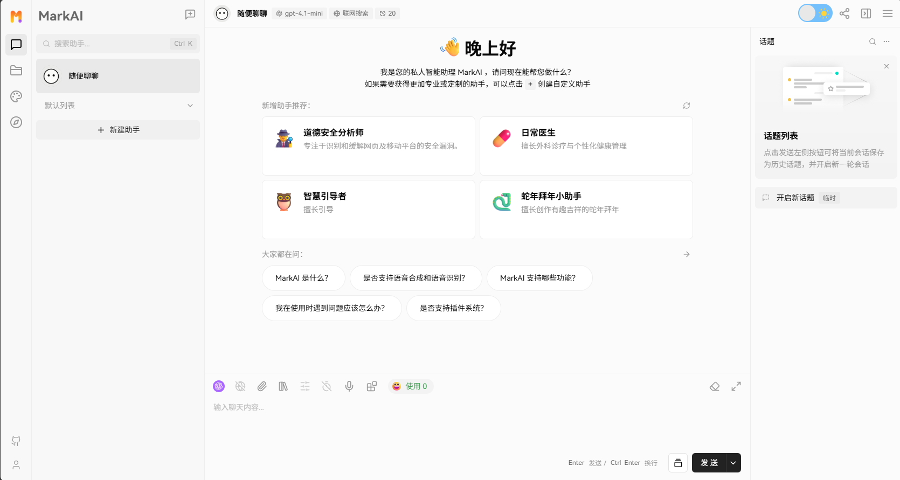
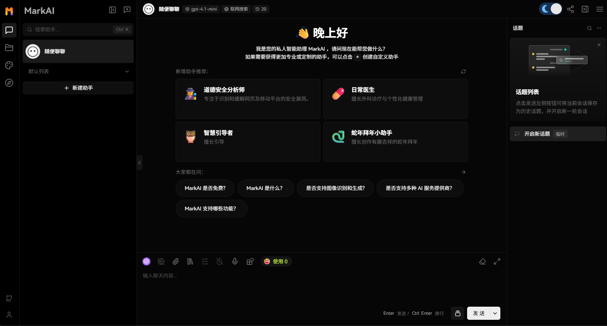
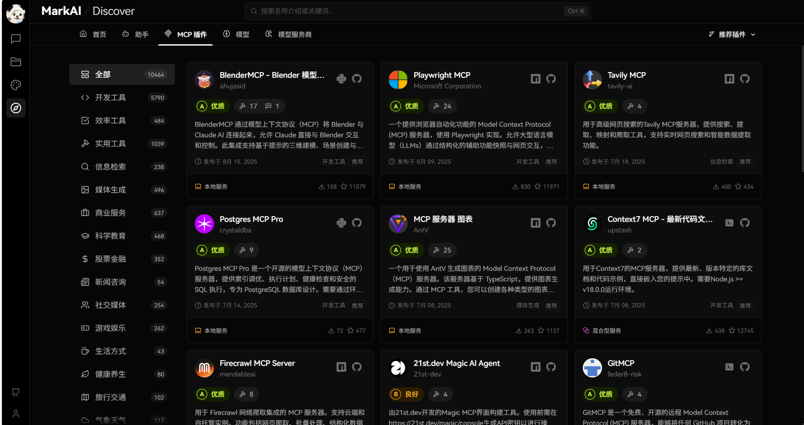
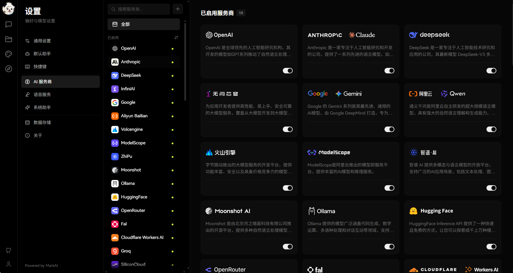
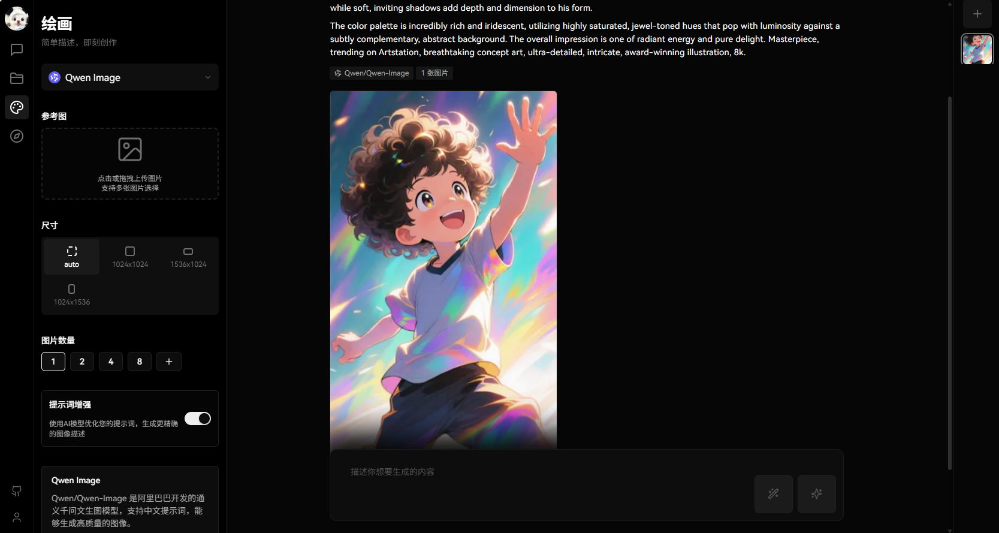
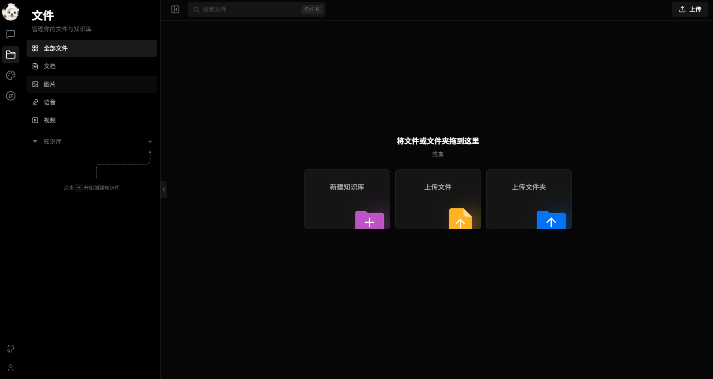
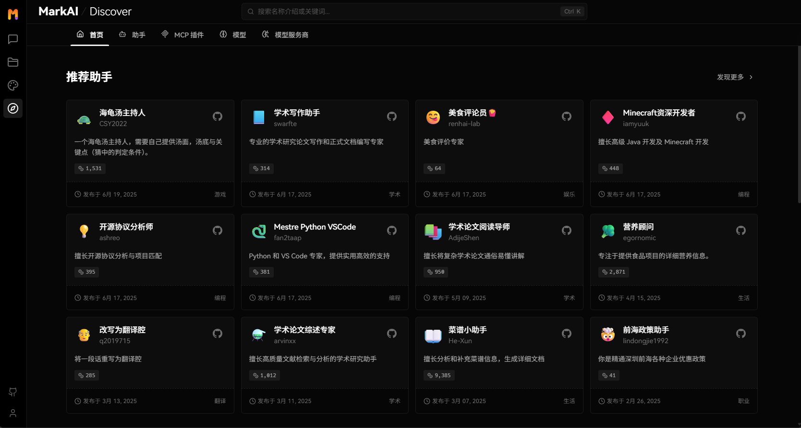

<h1>MarkAI</h1>

现代化设计的开源 ChatGPT/LLMs 聊天应用与开发框架 
支持语音合成、多模态、可扩展的（\[function call]\[docs-functionc-call]）插件系统 
一键**免费**拥有你自己的 ChatGPT/Gemini/Claude/Ollama 应用

[English](./README.md) · **简体中文**

<!-- SHIELD GROUP -->

\[!\[]\[github-release-shield]]\[github-release-link]
\[!\[]\[docker-release-shield]]\[docker-release-link]
\[!\[]\[vercel-shield]]\[vercel-link]
\[!\[]\[discord-shield]]\[discord-link] 
\[!\[]\[codecov-shield]]\[codecov-link]
\[!\[]\[github-action-test-shield]]\[github-action-test-link]
\[!\[]\[github-action-release-shield]]\[github-action-release-link]
\[!\[]\[github-releasedate-shield]]\[github-releasedate-link] 
\[!\[]\[github-license-shield]]\[github-license-link] 

探索私人生产力的未来。在个体崛起的时代中为你打造.

<kbd>目录树</kbd>

#### TOC

- [👋🏻 开始使用 & 交流](#-开始使用--交流)
- [✨ 特性一览](#-特性一览)
  - [✨ MCP 插件一键安装](#-mcp-插件一键安装)
  - [🏪 MCP 市场](#-mcp-市场)
  - [🖥️ 桌面应用](#️-桌面应用)
  - [🌐 智能联网搜索](#-智能联网搜索)
  - [\[思维链 (CoT)\]\[docs-feat-cot\]](#思维链-cotdocs-feat-cot)
  - [\[分支对话\]\[docs-feat-branch\]](#分支对话docs-feat-branch)
  - [\[支持白板 (Artifacts)\]\[docs-feat-artifacts\]](#支持白板-artifactsdocs-feat-artifacts)
  - [\[文件上传 / 知识库\]\[docs-feat-knowledgebase\]](#文件上传--知识库docs-feat-knowledgebase)
  - [\[多模型服务商支持\]\[docs-feat-provider\]](#多模型服务商支持docs-feat-provider)
  - [\[支持本地大语言模型 (LLM)\]\[docs-feat-local\]](#支持本地大语言模型-llmdocs-feat-local)
  - [\[模型视觉识别 (Model Visual)\]\[docs-feat-vision\]](#模型视觉识别-model-visualdocs-feat-vision)
  - [\[TTS & STT 语音会话\]\[docs-feat-tts\]](#tts--stt-语音会话docs-feat-tts)
  - [\[Text to Image 文生图\]\[docs-feat-t2i\]](#text-to-image-文生图docs-feat-t2i)
  - [\[插件系统 (Tools Calling)\]\[docs-feat-plugin\]](#插件系统-tools-callingdocs-feat-plugin)
  - [\[助手市场 (GPTs)\]\[docs-feat-agent\]](#助手市场-gptsdocs-feat-agent)
  - [\[支持本地 / 远程数据库\]\[docs-feat-database\]](#支持本地--远程数据库docs-feat-database)
  - [\[渐进式 Web 应用 (PWA)\]\[docs-feat-pwa\]](#渐进式-web-应用-pwadocs-feat-pwa)
  - [\[移动设备适配\]\[docs-feat-mobile\]](#移动设备适配docs-feat-mobile)
  - [\[自定义主题\]\[docs-feat-theme\]](#自定义主题docs-feat-theme)
  - [`*` 更多特性](#-更多特性)

####

 

## 👋🏻 开始使用 & 交流

我们是一群充满热情的设计工程师，希望为 AIGC 提供现代化的设计组件和工具，并以开源的方式分享。
同时通过 Bootstrapping 的方式，我们希望能够为开发者和用户提供一个更加开放、更加透明友好的产品生态。

不论普通用户与专业开发者，MarkAI 旨在成为所有人的 AI Agent 实验场。MarkAI 目前正在积极开发中，有任何需求或者问题，欢迎提交问题反馈。

| \[!\[]\[vercel-shield-badge]]\[vercel-link]   | 无需安装或注册！访问我们的网站，快速体验                                     |
| :-------------------------------------------- | :--------------------------------------------------------------------------- |
| \[!\[]\[discord-shield-badge]]\[discord-link] | 加入我们的 Discord 社区！这是你可以与开发者和其他 LobeHub 热衷用户交流的地方 |

> \[!IMPORTANT]
>
> **收藏项目**，你将从 GitHub 上无延迟地接收所有发布通知～⭐️

## ✨ 特性一览

通过 MarkAI 的强大功能，体验为无缝连接、提升效率和无限创意而设计的全新 AI 体验。

### ✨ MCP 插件一键安装

**无缝连接你的 AI 与世界**

通过启用与外部工具、数据源和服务的平滑、安全和动态交互，释放你的 AI 的全部潜力。基于 MCP（模型上下文协议）的插件系统打破了 AI 与数字生态系统之间的壁垒，实现了前所未有的连接性和功能性。

将对话转化为强大的工作流程，连接数据库、API、文件系统等。体验真正理解并与你的世界互动的 AI Agent。

[!\[\]\[back-to-top\]](#readme-top)

### 🏪 MCP 市场

**发现、连接、扩展**

浏览不断增长的 MCP 插件库，轻松扩展你的 AI 能力并简化工作流程。访问 [lobehub.com/mcp](https://lobehub.com/mcp) 探索 MCP 市场，提供精选的集成集合，增强你的 AI 与各种工具和服务协作的能力。

从生产力工具到开发环境，发现扩展 AI 覆盖范围和效率的新方式。与社区连接，找到满足特定需求的完美插件。

[!\[\]\[back-to-top\]](#readme-top)

### 🖥️ 桌面应用

**巅峰性能，零干扰**

获得完整的 MarkAI 体验，摆脱浏览器限制 —— 轻量级、专注且随时就绪。我们的桌面应用程序为你的 AI 交互提供专用环境，确保最佳性能和最小干扰。

体验更快的响应时间、更好的资源管理和与 AI 助手的更稳定连接。桌面应用专为要求 AI 工具最佳性能的用户设计。

[!\[\]\[back-to-top\]](#readme-top)

### 🌐 智能联网搜索

**在线知识，按需获取**

通过实时联网访问，你的 AI 与世界保持同步 —— 新闻、数据、趋势等。保持信息更新，获取最新可用信息，使你的 AI 能够提供准确和最新的回复。

访问实时信息，验证事实，探索当前事件，无需离开对话。你的 AI 成为通向世界知识的门户，始终保持最新和全面。

[!\[\]\[back-to-top\]](#readme-top)

### \[思维链 (CoT)]\[docs-feat-cot]

体验前所未有的 AI 推理过程。通过创新的思维链（CoT）可视化功能，您可以实时观察复杂问题是如何一步步被解析的。这项突破性的功能为 AI 的决策过程提供了前所未有的透明度，让您能够清晰地了解结论是如何得出的。

通过将复杂的推理过程分解为清晰的逻辑步骤，您可以更好地理解和验证 AI 的解题思路。无论您是在调试问题、学习知识，还是单纯对 AI 推理感兴趣，思维链可视化都能将抽象思维转化为一种引人入胜的互动体验。

[!\[\]\[back-to-top\]](#readme-top)

### \[分支对话]\[docs-feat-branch]

为您带来更自然、更灵活的 AI 对话方式。通过分支对话功能，您的讨论可以像人类对话一样自然延伸。在任意消息处创建新的对话分支，让您在保留原有上下文的同时，自由探索不同的对话方向。

两种强大模式任您选择：

- **延续模式**：无缝延展当前讨论，保持宝贵的对话上下文
- **独立模式**：基于任意历史消息，开启全新话题探讨

这项突破性功能将线性对话转变为动态的树状结构，让您能够更深入地探索想法，实现更高效的互动体验。

[!\[\]\[back-to-top\]](#readme-top)

### \[支持白板 (Artifacts)]\[docs-feat-artifacts]

体验集成于 LobeChat 的 Claude Artifacts 能力。这项革命性功能突破了 AI 人机交互的边界，让您能够实时创建和可视化各种格式的内容。

以前所未有的灵活度进行创作与可视化：

- 生成并展示动态 SVG 图形
- 实时构建与渲染交互式 HTML 页面
- 输出多种格式的专业文档

[!\[\]\[back-to-top\]](#readme-top)

### \[文件上传 / 知识库]\[docs-feat-knowledgebase]

MarkAI 支持文件上传与知识库功能，你可以上传文件、图片、音频、视频等多种类型的文件，以及创建知识库，方便用户管理和查找文件。同时在对话中使用文件和知识库功能，实现更加丰富的对话体验。

[!\[\]\[back-to-top\]](#readme-top)

### \[多模型服务商支持]\[docs-feat-provider]

在 MarkAI 的不断发展过程中，我们深刻理解到在提供 AI 会话服务时模型服务商的多样性对于满足社区需求的重要性。因此，我们不再局限于单一的模型服务商，而是拓展了对多种模型服务商的支持，以便为用户提供更为丰富和多样化的会话选择。

通过这种方式，MarkAI 能够更灵活地适应不同用户的需求，同时也为开发者提供了更为广泛的选择空间。

#### 已支持的模型服务商

我们已经实现了对以下模型服务商的支持：

<!-- PROVIDER LIST -->

- **[OpenAI](https://lobechat.com/discover/provider/openai)**: OpenAI 是全球领先的人工智能研究机构，其开发的模型如 GPT 系列推动了自然语言处理的前沿。OpenAI 致力于通过创新和高效的 AI 解决方案改变多个行业。他们的产品具有显著的性能和经济性，广泛用于研究、商业和创新应用。
- **[Ollama](https://lobechat.com/discover/provider/ollama)**: Ollama 提供的模型广泛涵盖代码生成、数学运算、多语种处理和对话互动等领域，支持企业级和本地化部署的多样化需求。
- **[Anthropic](https://lobechat.com/discover/provider/anthropic)**: Anthropic 是一家专注于人工智能研究和开发的公司，提供了一系列先进的语言模型，如 Claude 3.5 Sonnet、Claude 3 Sonnet、Claude 3 Opus 和 Claude 3 Haiku。这些模型在智能、速度和成本之间取得了理想的平衡，适用于从企业级工作负载到快速响应的各种应用场景。Claude 3.5 Sonnet 作为其最新模型，在多项评估中表现优异，同时保持了较高的性价比。
- **[Bedrock](https://lobechat.com/discover/provider/bedrock)**: Bedrock 是亚马逊 AWS 提供的一项服务，专注于为企业提供先进的 AI 语言模型和视觉模型。其模型家族包括 Anthropic 的 Claude 系列、Meta 的 Llama 3.1 系列等，涵盖从轻量级到高性能的多种选择，支持文本生成、对话、图像处理等多种任务，适用于不同规模和需求的企业应用。
- **[Google](https://lobechat.com/discover/provider/google)**: Google 的 Gemini 系列是其最先进、通用的 AI 模型，由 Google DeepMind 打造，专为多模态设计，支持文本、代码、图像、音频和视频的无缝理解与处理。适用于从数据中心到移动设备的多种环境，极大提升了 AI 模型的效率与应用广泛性。
- **[DeepSeek](https://lobechat.com/discover/provider/deepseek)**: DeepSeek 是一家专注于人工智能技术研究和应用的公司，其最新模型 DeepSeek-V3 多项评测成绩超越 Qwen2.5-72B 和 Llama-3.1-405B 等开源模型，性能对齐领军闭源模型 GPT-4o 与 Claude-3.5-Sonnet。
- **[HuggingFace](https://lobechat.com/discover/provider/huggingface)**: HuggingFace Inference API 提供了一种快速且免费的方式，让您可以探索成千上万种模型，适用于各种任务。无论您是在为新应用程序进行原型设计，还是在尝试机器学习的功能，这个 API 都能让您即时访问多个领域的高性能模型。
- **[OpenRouter](https://lobechat.com/discover/provider/openrouter)**: OpenRouter 是一个提供多种前沿大模型接口的服务平台，支持 OpenAI、Anthropic、LLaMA 及更多，适合多样化的开发和应用需求。用户可根据自身需求灵活选择最优的模型和价格，助力 AI 体验的提升。
- **[Cloudflare Workers AI](https://lobechat.com/discover/provider/cloudflare)**: 在 Cloudflare 的全球网络上运行由无服务器 GPU 驱动的机器学习模型。
- **[GitHub](https://lobechat.com/discover/provider/github)**: 通过 GitHub 模型，开发人员可以成为 AI 工程师，并使用行业领先的 AI 模型进行构建。

<kbd>See more providers (+31)</kbd>

- **[Novita](https://lobechat.com/discover/provider/novita)**: Novita AI 是一个提供多种大语言模型与 AI 图像生成的 API 服务的平台，灵活、可靠且具有成本效益。它支持 Llama3、Mistral 等最新的开源模型，并为生成式 AI 应用开发提供了全面、用户友好且自动扩展的 API 解决方案，适合 AI 初创公司的快速发展。
- **[PPIO](https://lobechat.com/discover/provider/ppio)**: PPIO 派欧云提供稳定、高性价比的开源模型 API 服务，支持 DeepSeek 全系列、Llama、Qwen 等行业领先大模型。
- **[Together AI](https://lobechat.com/discover/provider/togetherai)**: Together AI 致力于通过创新的 AI 模型实现领先的性能，提供广泛的自定义能力，包括快速扩展支持和直观的部署流程，满足企业的各种需求。
- **[Fireworks AI](https://lobechat.com/discover/provider/fireworksai)**: Fireworks AI 是一家领先的高级语言模型服务商，专注于功能调用和多模态处理。其最新模型 Firefunction V2 基于 Llama-3，优化用于函数调用、对话及指令跟随。视觉语言模型 FireLLaVA-13B 支持图像和文本混合输入。其他 notable 模型包括 Llama 系列和 Mixtral 系列，提供高效的多语言指令跟随与生成支持。
- **[Groq](https://lobechat.com/discover/provider/groq)**: Groq 的 LPU 推理引擎在最新的独立大语言模型（LLM）基准测试中表现卓越，以其惊人的速度和效率重新定义了 AI 解决方案的标准。Groq 是一种即时推理速度的代表，在基于云的部署中展现了良好的性能。
- **[Perplexity](https://lobechat.com/discover/provider/perplexity)**: Perplexity 是一家领先的对话生成模型提供商，提供多种先进的 Llama 3.1 模型，支持在线和离线应用，特别适用于复杂的自然语言处理任务。
- **[Mistral](https://lobechat.com/discover/provider/mistral)**: Mistral 提供先进的通用、专业和研究型模型，广泛应用于复杂推理、多语言任务、代码生成等领域，通过功能调用接口，用户可以集成自定义功能，实现特定应用。
- **[ModelScope](https://lobechat.com/discover/provider/modelscope)**: ModelScope 是阿里云推出的模型即服务平台，提供丰富的 AI 模型和推理服务。
- **[Ai21Labs](https://lobechat.com/discover/provider/ai21)**: AI21 Labs 为企业构建基础模型和人工智能系统，加速生成性人工智能在生产中的应用。
- **[Upstage](https://lobechat.com/discover/provider/upstage)**: Upstage 专注于为各种商业需求开发 AI 模型，包括 Solar LLM 和文档 AI，旨在实现工作的人造通用智能（AGI）。通过 Chat API 创建简单的对话代理，并支持功能调用、翻译、嵌入以及特定领域应用。
- **[xAI (Grok)](https://lobechat.com/discover/provider/xai)**: xAI 是一家致力于构建人工智能以加速人类科学发现的公司。我们的使命是推动我们对宇宙的共同理解。
- **[Aliyun Bailian](https://lobechat.com/discover/provider/qwen)**: 通义千问是阿里云自主研发的超大规模语言模型，具有强大的自然语言理解和生成能力。它可以回答各种问题、创作文字内容、表达观点看法、撰写代码等，在多个领域发挥作用。
- **[Wenxin](https://lobechat.com/discover/provider/wenxin)**: 企业级一站式大模型与 AI 原生应用开发及服务平台，提供最全面易用的生成式人工智能模型开发、应用开发全流程工具链
- **[Hunyuan](https://lobechat.com/discover/provider/hunyuan)**: 由腾讯研发的大语言模型，具备强大的中文创作能力，复杂语境下的逻辑推理能力，以及可靠的任务执行能力
- **[ZhiPu](https://lobechat.com/discover/provider/zhipu)**: 智谱 AI 提供多模态与语言模型的开放平台，支持广泛的 AI 应用场景，包括文本处理、图像理解与编程辅助等。
- **[SiliconCloud](https://lobechat.com/discover/provider/siliconcloud)**: SiliconCloud，基于优秀开源基础模型的高性价比 GenAI 云服务
- **[01.AI](https://lobechat.com/discover/provider/zeroone)**: 零一万物致力于推动以人为本的 AI 2.0 技术革命，旨在通过大语言模型创造巨大的经济和社会价值，并开创新的 AI 生态与商业模式。
- **[Spark](https://lobechat.com/discover/provider/spark)**: 科大讯飞星火大模型提供多领域、多语言的强大 AI 能力，利用先进的自然语言处理技术，构建适用于智能硬件、智慧医疗、智慧金融等多种垂直场景的创新应用。
- **[SenseNova](https://lobechat.com/discover/provider/sensenova)**: 商汤日日新，依托商汤大装置的强大的基础支撑，提供高效易用的全栈大模型服务。
- **[Stepfun](https://lobechat.com/discover/provider/stepfun)**: 阶级星辰大模型具备行业领先的多模态及复杂推理能力，支持超长文本理解和强大的自主调度搜索引擎功能。
- **[Moonshot](https://lobechat.com/discover/provider/moonshot)**: Moonshot 是由北京月之暗面科技有限公司推出的开源平台，提供多种自然语言处理模型，应用领域广泛，包括但不限于内容创作、学术研究、智能推荐、医疗诊断等，支持长文本处理和复杂生成任务。
- **[Baichuan](https://lobechat.com/discover/provider/baichuan)**: 百川智能是一家专注于人工智能大模型研发的公司，其模型在国内知识百科、长文本处理和生成创作等中文任务上表现卓越，超越了国外主流模型。百川智能还具备行业领先的多模态能力，在多项权威评测中表现优异。其模型包括 Baichuan 4、Baichuan 3 Turbo 和 Baichuan 3 Turbo 128k 等，分别针对不同应用场景进行优化，提供高性价比的解决方案。
- **[Minimax](https://lobechat.com/discover/provider/minimax)**: MiniMax 是 2021 年成立的通用人工智能科技公司，致力于与用户共创智能。MiniMax 自主研发了不同模态的通用大模型，其中包括万亿参数的 MoE 文本大模型、语音大模型以及图像大模型。并推出了海螺 AI 等应用。
- **[InternLM](https://lobechat.com/discover/provider/internlm)**: 致力于大模型研究与开发工具链的开源组织。为所有 AI 开发者提供高效、易用的开源平台，让最前沿的大模型与算法技术触手可及
- **[Higress](https://lobechat.com/discover/provider/higress)**: Higress 是一款云原生 API 网关，在阿里内部为解决 Tengine reload 对长连接业务有损，以及 gRPC/Dubbo 负载均衡能力不足而诞生。
- **[Gitee AI](https://lobechat.com/discover/provider/giteeai)**: Gitee AI 的 Serverless API 为 AI 开发者提供开箱即用的大模型推理 API 服务。
- **[Taichu](https://lobechat.com/discover/provider/taichu)**: 中科院自动化研究所和武汉人工智能研究院推出新一代多模态大模型，支持多轮问答、文本创作、图像生成、3D 理解、信号分析等全面问答任务，拥有更强的认知、理解、创作能力，带来全新互动体验。
- **[360 AI](https://lobechat.com/discover/provider/ai360)**: 360 AI 是 360 公司推出的 AI 模型和服务平台，提供多种先进的自然语言处理模型，包括 360GPT2 Pro、360GPT Pro、360GPT Turbo 和 360GPT Turbo Responsibility 8K。这些模型结合了大规模参数和多模态能力，广泛应用于文本生成、语义理解、对话系统与代码生成等领域。通过灵活的定价策略，360 AI 满足多样化用户需求，支持开发者集成，推动智能化应用的革新和发展。
- **[Search1API](https://lobechat.com/discover/provider/search1api)**: Search1API 提供可根据需要自行联网的 DeepSeek 系列模型的访问，包括标准版和快速版本，支持多种参数规模的模型选择。
- **[InfiniAI](https://lobechat.com/discover/provider/infiniai)**: 为应用开发者提供高性能、易上手、安全可靠的大模型服务，覆盖从大模型开发到大模型服务化部署的全流程。
- **[Qiniu](https://lobechat.com/discover/provider/qiniu)**: 七牛作为老牌云服务厂商，提供高性价比稳定的实时、批量 AI 推理服务，简单易用。

> 📊 Total providers: [<kbd>**41**</kbd>](https://lobechat.com/discover/providers)

 <!-- PROVIDER LIST -->

同时，我们也在计划支持更多的模型服务商，以进一步丰富我们的服务商库。如果你希望让 MarkAI 支持你喜爱的服务商，欢迎加入我们的社区讨论。

[!\[\]\[back-to-top\]](#readme-top)

### \[支持本地大语言模型 (LLM)]\[docs-feat-local]

为了满足特定用户的需求，MarkAI 还基于 [Ollama](https://ollama.ai) 支持了本地模型的使用，让用户能够更灵活地使用自己的或第三方的模型。

[!\[\]\[back-to-top\]](#readme-top)

### \[模型视觉识别 (Model Visual)]\[docs-feat-vision]

MarkAI 已经支持 OpenAI 最新的 [`gpt-4-vision`](https://platform.openai.com/docs/guides/vision) 支持视觉识别的模型，这是一个具备视觉识别能力的多模态应用。
用户可以轻松上传图片或者拖拽图片到对话框中，助手将能够识别图片内容，并在此基础上进行智能对话，构建更智能、更多元化的聊天场景。

这一特性打开了新的互动方式，使得交流不再局限于文字，而是可以涵盖丰富的视觉元素。无论是日常使用中的图片分享，还是在特定行业内的图像解读，助手都能提供出色的对话体验。

[!\[\]\[back-to-top\]](#readme-top)

### \[TTS & STT 语音会话]\[docs-feat-tts]

MarkAI 支持文字转语音（Text-to-Speech，TTS）和语音转文字（Speech-to-Text，STT）技术，这使得我们的应用能够将文本信息转化为清晰的语音输出，用户可以像与真人交谈一样与我们的对话助手进行交流。
用户可以从多种声音中选择，给助手搭配合适的音源。 同时，对于那些倾向于听觉学习或者想要在忙碌中获取信息的用户来说，TTS 提供了一个极佳的解决方案。

在 MarkAI 中，我们精心挑选了一系列高品质的声音选项 (OpenAI Audio, Microsoft Edge Speech)，以满足不同地域和文化背景用户的需求。用户可以根据个人喜好或者特定场景来选择合适的语音，从而获得个性化的交流体验。

[!\[\]\[back-to-top\]](#readme-top)

### \[Text to Image 文生图]\[docs-feat-t2i]

支持最新的文本到图片生成技术，MarkAI 现在能够让用户在与助手对话中直接调用文生图工具进行创作。
通过利用 [`DALL-E 3`](https://openai.com/dall-e-3)、[`MidJourney`](https://www.midjourney.com/) 和 [`Pollinations`](https://pollinations.ai/) 等 AI 工具的能力， 助手们现在可以将你的想法转化为图像。
同时可以更私密和沉浸式地完成你的创作过程。

[!\[\]\[back-to-top\]](#readme-top)

### \[插件系统 (Tools Calling)]\[docs-feat-plugin]

MarkAI 的插件生态系统是其核心功能的重要扩展，它极大地增强了 ChatGPT 的实用性和灵活性。

<video controls src="https://github.com/lobehub/lobe-chat/assets/28616219/f29475a3-f346-4196-a435-41a6373ab9e2" muted="false"></video>

通过利用插件，MarkAI 能够实现实时信息的获取和处理，例如自动获取最新新闻头条，为用户提供即时且相关的资讯。

此外，这些插件不仅局限于新闻聚合，还可以扩展到其他实用的功能，如快速检索文档、生成图象、获取电商平台数据，以及其他各式各样的第三方服务。

<!-- PLUGIN LIST -->

| 最近新增                                                                                                                   | 描述                                                                               |
| -------------------------------------------------------------------------------------------------------------------------- | ---------------------------------------------------------------------------------- |
| [PortfolioMeta](https://lobechat.com/discover/plugin/StockData) By **portfoliometa** on **2025-07-21**      | 分析股票并获取全面的实时投资数据和分析。 `股票`                                |
| [Speak](https://lobechat.com/discover/plugin/speak) By **speak** on **2025-07-18**                          | 使用 Speak，您的 AI 语言导师，学习如何用另一种语言说任何事情。 `教育` `语言`   |
| [网页](https://lobechat.com/discover/plugin/web) By **Proghit** on **2025-01-24**                           | 智能网页搜索，读取和分析页面，以提供来自 Google 结果的全面答案。 `网页` `搜索` |
| [必应网页搜索](https://lobechat.com/discover/plugin/Bingsearch-identifier) By **FineHow** on **2024-12-22** | 通过 BingApi 搜索互联网上的信息 `bingsearch`                                   |

> 📊 Total plugins: [<kbd>**43**</kbd>](https://lobechat.com/discover/plugins)

 <!-- PLUGIN LIST -->

[!\[\]\[back-to-top\]](#readme-top)

### \[助手市场 (GPTs)]\[docs-feat-agent]

在 MarkAI 的助手市场中，创作者们可以发现一个充满活力和创新的社区，它汇聚了众多精心设计的助手，这些助手不仅在工作场景中发挥着重要作用，也在学习过程中提供了极大的便利。
我们的市场不仅是一个展示平台，更是一个协作的空间。在这里，每个人都可以贡献自己的智慧，分享个人开发的助手。

> \[!TIP]
>
> 通过提交助手，你可以轻松地将你的助手作品提交到我们的平台。我们特别强调的是，MarkAI 建立了一套精密的自动化国际化（i18n）工作流程， 它的强大之处在于能够无缝地将你的助手转化为多种语言版本。
> 这意味着，不论你的用户使用何种语言，他们都能无障碍地体验到你的助手。

> \[!IMPORTANT]
>
> 我欢迎所有用户加入这个不断成长的生态系统，共同参与到助手的迭代与优化中来。共同创造出更多有趣、实用且具有创新性的助手，进一步丰富助手的多样性和实用性。

<!-- AGENT LIST -->

| 最近新增                                                                                                                                                         | 描述                                                                                                              |
| ---------------------------------------------------------------------------------------------------------------------------------------------------------------- | ----------------------------------------------------------------------------------------------------------------- |
| [海龟汤主持人](https://lobechat.com/discover/assistant/lateral-thinking-puzzle) By **[CSY2022](https://github.com/CSY2022)** on **2025-06-19**    | 一个海龟汤主持人，需要自己提供汤面，汤底与关键点（猜中的判定条件）。 `海龟汤` `推理` `互动` `谜题` `角色扮演` |
| [美食评论员🍟](https://lobechat.com/discover/assistant/food-reviewer) By **[renhai-lab](https://github.com/renhai-lab)** on **2025-06-17**        | 美食评价专家 `美食` `评价` `写作`                                                                             |
| [学术写作助手](https://lobechat.com/discover/assistant/academic-writing-assistant) By **[swarfte](https://github.com/swarfte)** on **2025-06-17** | 专业的学术研究论文写作和正式文档编写专家 `学术写作` `研究` `正式风格`                                         |
| [Minecraft 资深开发者](https://lobechat.com/discover/assistant/java-development) By **[iamyuuk](https://github.com/iamyuuk)** on **2025-06-17**   | 擅长高级 Java 开发及 Minecraft 开发 `开发` `编程` `minecraft` `java`                                          |

> 📊 Total agents: [<kbd>**505**</kbd> ](https://lobechat.com/discover/assistants)

 <!-- AGENT LIST -->

[!\[\]\[back-to-top\]](#readme-top)

### \[支持本地 / 远程数据库]\[docs-feat-database]

MarkAI 支持同时使用服务端数据库和本地数据库。根据您的需求，您可以选择合适的部署方案：

- 本地数据库：适合希望对数据有更多掌控感和隐私保护的用户。MarkAI 采用了 CRDT (Conflict-Free Replicated Data Type) 技术，实现了多端同步功能。这是一项实验性功能，旨在提供无缝的数据同步体验。
- 服务端数据库：适合希望更便捷使用体验的用户。MarkAI 支持 PostgreSQL 作为服务端数据库。

无论您选择哪种数据库，MarkAI 都能为您提供卓越的用户体验。

[!\[\]\[back-to-top\]](#readme-top)

### \[渐进式 Web 应用 (PWA)]\[docs-feat-pwa]

我们深知在当今多设备环境下为用户提供无缝体验的重要性。为此，我们采用了渐进式 Web 应用 [PWA](https://support.google.com/chrome/answer/9658361) 技术，
这是一种能够将网页应用提升至接近原生应用体验的现代 Web 技术。通过 PWA，MarkAI 能够在桌面和移动设备上提供高度优化的用户体验，同时保持轻量级和高性能的特点。
在视觉和感觉上，我们也经过精心设计，以确保它的界面与原生应用无差别，提供流畅的动画、响应式布局和适配不同设备的屏幕分辨率。

> \[!NOTE]
>
> 若您未熟悉 PWA 的安装过程，您可以按照以下步骤将 MarkAI 添加为您的桌面应用（也适用于移动设备）：
>
> - 在电脑上运行 Chrome 或 Edge 浏览器 .
> - 访问 MarkAI 网页 .
> - 在地址栏的右上角，单击 <kbd>安装</kbd> 图标 .

[!\[\]\[back-to-top\]](#readme-top)

### \[移动设备适配]\[docs-feat-mobile]

针对移动设备进行了一系列的优化设计，以提升用户的移动体验。目前，我们正在对移动端的用户体验进行版本迭代，以实现更加流畅和直观的交互。如果您有任何建议或想法，我们非常欢迎您通过 GitHub Issues 或者 Pull Requests 提供反馈。

[!\[\]\[back-to-top\]](#readme-top)

### \[自定义主题]\[docs-feat-theme]

作为设计工程师出身，MarkAI 在界面设计上充分考虑用户的个性化体验，因此引入了灵活多变的主题模式，其中包括日间的亮色模式和夜间的深色模式。
除了主题模式的切换，还提供了一系列的颜色定制选项，允许用户根据自己的喜好来调整应用的主题色彩。无论是想要沉稳的深蓝，还是希望活泼的桃粉，或者是专业的灰白，用户都能够在 MarkAI 中找到匹配自己风格的颜色选择。

> \[!TIP]
>
> 默认配置能够智能地识别用户系统的颜色模式，自动进行主题切换，以确保应用界面与操作系统保持一致的视觉体验。对于喜欢手动调控细节的用户，MarkAI 同样提供了直观的设置选项，针对聊天场景也提供了对话气泡模式和文档模式的选择。

[!\[\]\[back-to-top\]](#readme-top)

### `*` 更多特性

除了上述功能特性以外，MarkAI 所具有的设计和技术能力将为你带来更多使用保障：

- [x] 💎 **精致 UI 设计**：经过精心设计的界面，具有优雅的外观和流畅的交互效果，支持亮暗色主题，适配移动端。支持 PWA，提供更加接近原生应用的体验。
- [x] 🗣️ **流畅的对话体验**：流式响应带来流畅的对话体验，并且支持完整的 Markdown 渲染，包括代码高亮、LaTex 公式、Mermaid 流程图等。
- [x] 💨 **快速部署**：使用 Vercel 平台或者我们的 Docker 镜像，只需点击一键部署按钮，即可在 1 分钟内完成部署，无需复杂的配置过程。
- [x] 🔒 **隐私安全**：所有数据保存在用户浏览器本地，保证用户的隐私安全。
- [x] 🌐 **自定义域名**：如果用户拥有自己的域名，可以将其绑定到平台上，方便在任何地方快速访问对话助手。

> ✨ 随着产品迭代持续更新，我们将会带来更多更多令人激动的功能！

---

> \[!NOTE]
>
> 你可以在 Projects 中找到我们后续的路线图计划

[!\[\]\[back-to-top\]](#readme-top)

---

<h4>📝 License</h4>

This project is [Apache 2.0](./LICENSE) licensed.

Copyright © 2025 MarkAI.  
This project is [Apache 2.0](./LICENSE) licensed.
